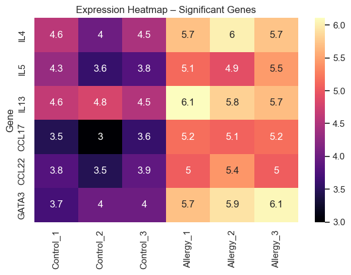
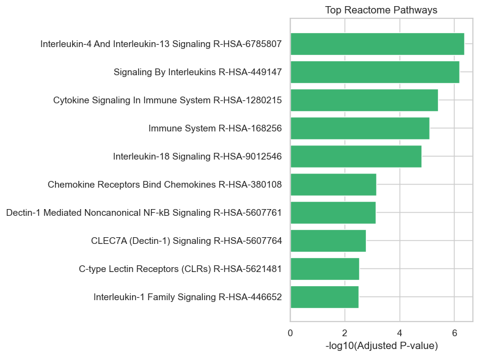
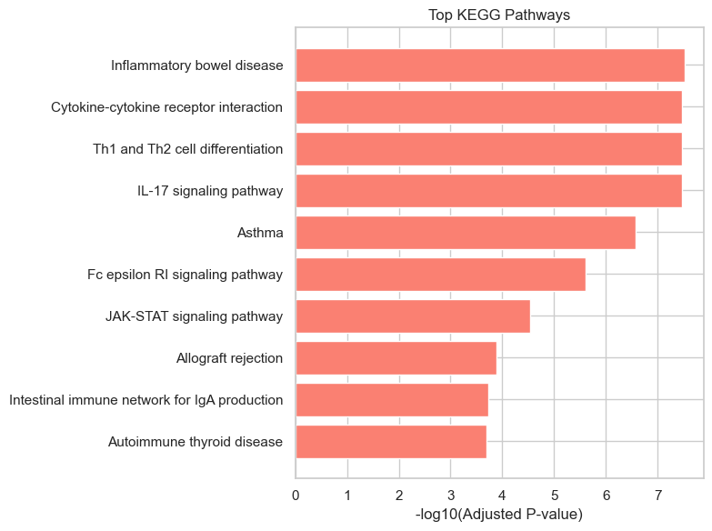

# Chocolate Allergy – RNA-seq Simulation

## Introduction

A simulated RNA-seq count matrix for genes involved in allergic response, built to explore immune activation in a chocolate allergy scenario.  
Created as part of a conceptual and ethical exploration in computational biology.
This project now includes functional enrichment analyses to explore the biological context of simulated gene expression.

## Purpose

This simulation was designed to:
- Practice RNA-seq data modeling using Python
- Explore the biological logic of allergic reactions
- Perform functional enrichment (GO, KEGG, Reactome) to interpret gene-level findings
- Prepare for future DE analysis with real datasets

## Methods Used

- Poisson distribution for count data generation
- Custom λ values for control vs allergy-exposed samples
- Pandas and NumPy for structuring the data
- gseapy used to access Enrichr API
- GO Biological Process, KEGG Pathway, and Reactome databases queried
- Top enriched terms visualized using barplots

### Files Included

- `chocolate_simulation.py` – Main Python script for data generation  
- `counts.csv` – Simulated count matrix (optional)  
- `go_barplot.png` – GO enrichment visualization  
- `kegg_barplot.png` – KEGG pathway enrichment  
- `reactome_barplot.png` – Reactome pathway enrichment  
- `gene_list.txt` – Significant genes used in enrichment

## Creative Context

Inspired by the question: "What genes wake up when chocolate triggers an immune reaction?"  
Blending scientific rigor with intuitive design, this repo reflects a personal learning journey.

## Data Transformation and Statistical Analyses

A log2 transformation was applied to normalize raw count data and reduce expression scale variance. Samples were grouped as Control and Allergy to reflect contrasting immune environments.
- T-tests were conducted per gene to detect differential expression.
- Log2 fold change values were computed between allergy and control groups.
- Multiple hypothesis testing was corrected using Benjamini-Hochberg (FDR) method.
- Genes with adjusted p-values below 0.05 were selected as statistically significant.
This step ensures reliable identification of genes that respond to the simulated allergic condition.

## Visualization
  
They highlight differentially expressed genes and sample-level patterns.

Two visualizations were used to highlight the results:

### Volcano Plot

This plot illustrates the relationship between log2 fold change and statistical significance for each gene.  
Genes with strong fold change and low p-value appear in the corners, especially *IL4*, *IL5*, and *IL13*.

### Heatmap – Significant Genes

This heatmap reveals sample-level expression patterns for genes with adjusted p-values below 0.05.  
Allergy samples show elevated expression, especially in Th2-related cytokines and chemokines.

## Functional Enrichment – Barplots
Three barplots were generated to visualize the most enriched biological terms and pathways:
- GO Biological Process: Highlights immune-related processes such as cytokine signaling and cell activation
- KEGG Pathways: Shows systemic roles like Th2 differentiation and cytokine-cytokine receptor interaction
- Reactome Pathways: Reveals molecular events including interleukin signaling and STAT phosphorylation

### GO Enrichment Analysis

To identify biological processes associated with the simulated gene expression data, we performed Gene Ontology (GO) enrichment analysis using the `gseapy` Python package.

#### 🔬 Methodology
- **Tool**: `gseapy.enrichr`
- **Gene Set**: `GO_Biological_Process_2023`
- **Input**: `gene_list.txt`
- **Cutoff**: Adjusted p-value < 0.05

#### 📊 Results
The top 10 enriched biological processes were visualized using a barplot. Key processes included:

- **Regulation of immune response**
- **Inflammatory signaling**
- **Cellular response to cytokine stimulus**

These processes are consistent with the simulated allergy-related gene expression profile.

#### 📁 Output Files
- `results/go/go_barplot.png`: Barplot of top GO terms  
- `results/go/enrichr.GO_Biological_Process_2023.enrichr.reports.txt`: Full enrichment results

---

### 🧬 Reactome Pathway Analysis

To further explore the biological context of the significant genes, we conducted Reactome pathway enrichment analysis.

#### 🔬 Methodology
- **Tool**: `gseapy.enrichr`
- **Gene Set**: `Reactome_2022`
- **Input**: `gene_list.txt`
- **Cutoff**: Adjusted p-value < 0.05

#### 📊 Results
The top Reactome pathways were visualized using a barplot. Notable pathways included:

- **Interleukin signaling**
- **Immune system activation**
- **Signal transduction**

These pathways provide insight into the cellular mechanisms potentially involved in allergic responses.

#### 📁 Output Files
- `results/reactome/reactome_barplot.png`: Barplot of top Reactome pathways  
- `results/reactome/enrichr.Reactome_2022.enrichr.reports.txt`: Full enrichment results

---

### 🧪 KEGG Pathway Analysis

To explore the molecular mechanisms underlying the simulated allergy-related gene expression, we performed KEGG pathway enrichment analysis.

#### 🔬 Methodology
- **Tool**: `gseapy.enrichr`
- **Gene Set**: `KEGG_2023_Human`
- **Input**: `gene_list.txt`
- **Cutoff**: Adjusted p-value < 0.05

#### 📊 Results
The top 10 enriched KEGG pathways were visualized using a barplot. Notable pathways included:

- **Cytokine-cytokine receptor interaction**
- **JAK-STAT signaling pathway**
- **Toll-like receptor signaling**
- **Allergic response pathways**

These results align with the biological context of the simulated data and suggest potential molecular targets for further investigation.

#### 📁 Output Files
- `results/kegg/kegg_barplot.png`: Barplot of top KEGG pathways  
- `results/kegg/enrichr.KEGG_2023_Human.enrichr.reports.txt`: Full enrichment results

---

## Biological Interpretation

The expression profiles mimic a typical Th2 immune response seen in allergic reactions:
- IL4, IL5, IL13: Promote IgE class switching and eosinophil activation
- CCL17, CCL22: Direct immune cell recruitment to inflamed tissues
- GATA3: Th2 lineage transcription factor, consistent with observed gene patterns
Although based on simulated counts, gene behavior aligns with real biological pathways.
- Enrichment results reinforce the simulated Th2 immune response.
- GO terms and pathways consistently point to cytokine activity, immune cell recruitment, and transcriptional regulation—all hallmarks of allergic inflammation.

## Final Insights and Future Description

This RNA-seq simulation offers a scaffold for ethical data exploration and pipeline prototyping.
- Enables DE analysis without experimental or animal-derived data
- Supports scientific storytelling through open and reproducible code
- Prepares the groundwork for future integration with real datasets
- Functional enrichment adds a systems-level layer to the analysis, enabling deeper biological interpretation.
Future directions include integrating GSEA, clustering, and applying the pipeline to real RNA-seq datasets.

## Discussion

This simulation-based RNA-seq project demonstrates how synthetic data can be used to explore biologically meaningful patterns without relying on experimental or animal-derived datasets.  
The enrichment results—particularly those involving Th2 cytokines and interleukin signaling—align with known allergic response mechanisms, suggesting that even simplified models can reflect real biological logic.

While the dataset is simulated and lacks experimental noise or batch effects, it provides a clean scaffold for testing analysis pipelines and visualizing immune activation.  
This approach supports ethical innovation by enabling early-stage hypothesis generation and computational prototyping before moving to wet-lab validation.

Importantly, the project highlights the value of scientific storytelling and reproducibility.  
By documenting each step and visualizing results clearly, it becomes a resource not just for personal learning but for collaborative exploration.

Future work will focus on applying this pipeline to real RNA-seq datasets, integrating GSEA and clustering, and expanding biological annotation through multi-omic data.

## Technologies Used

- `Python` | `pandas` | `numpy`  
- `scipy.stats` | `matplotlib` | `seaborn`  
- `statsmodels` – for FDR correction  
- `gseapy` – for enrichment analysis  
- `matplotlib` – for custom barplot visualizations

## AI Collaboration Statement
This project was developed with support from Microsoft Copilot, an AI companion used to assist with scientific documentation, code structuring, and biological interpretation. Copilot provided guidance on enrichment analysis, visualization techniques, and ethical framing, helping to shape the project into a reproducible and meaningful scientific narrative.
All scientific decisions, data generation, and final interpretations were made by the author. AI assistance was used as a collaborative tool to enhance clarity, structure, and accessibility—never as a substitute for scientific judgment.

## Author

Designed and implemented by **Elif**, with a focus on ethical innovation and meaningful scientific impact.
